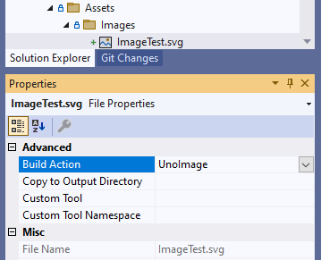
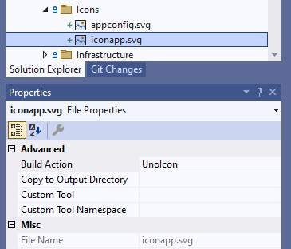
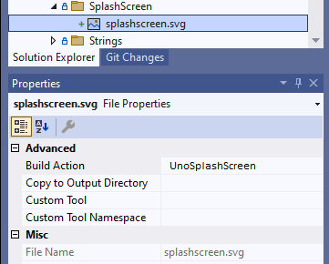

# How-To: Get Started with Uno.Resizetizer

Uno.Resizetizer is a set of MSBuild tasks to manage the assets of an app. Using this package, it is not needed to care about generating and maintaining different image sizes/scaling and creating a splash screen plumbing. It is only needed to provide an `svg` file and the tool will take care of the rest.

Starting Uno Platform 4.8, the solution template includes Uno.Resizetizer by default. If you want to use it with an application created from an earlier version of Uno Platform, you can follow the steps below.

> [!TIP]
> To create an app, make sure to visit [our getting started tutorials](xref:Uno.GetStarted).

## Manual Installation

Uno.Resizeter is delivered [through NuGet](https://www.nuget.org/packages/Uno.Resizetizer). In order to install it you can either download it using your IDE (this will be shown in the next steps) or added directly on your `.csproj` as shown in the [NuGet page](https://www.nuget.org/packages/Uno.Resizetizer/).

> [!NOTE]
> If you're using the new template, you can skip this step because it is already included by default with Uno Platform 4.8 and later.
  
### 1. Installing Uno.Resizetizer

* Open your favorite IDE, in this case, it will be Visual Studio, after that open the Manage NuGet packages window
* Search for `Uno.Resizetizer` and install it over your projects

> [!NOTE]
> Uno.Resizetizer is compatible with projects running .NET 6 and later.

## Usage

Uno.Resizetizer can handle:

* Images used in the application
* The App icon
* The splash screen

The next sections will show how to use it for each use case.

> [!WARNING]
> All the assets used by Uno.Resizetizer should be lower case and don't have special characters. You can use `_` to separate words.
> This is because the assets are used on different platforms and some of them have limitations on the characters that can be used.

### UnoImage

`UnoImage` is the build action used for images that will be part of the app.

### 2. Configure the project to use generated Images

* In the App Class library, create a folder called `Assets` (if doesn't exist) and then create a folder called `Images`. We now need to add assets to this folder.

> [!TIP]
> Those folder names are examples. It is possible to create folders with any name and how many levels are needed.

Make sure that the build assets are configured to be `UnoImage`. In the `csproj`, to make all files inside the `Assets\Images` folder to be automatically configured to be `UnoImage`, add the following:

```xml
<ItemGroup>
    <UnoImage Include="Assets\Images\*" />
</ItemGroup>
```

You can also make specific files to be `UnoImage` using VisualStudio, by right-clicking on the file and selecting `Properties` and then `Build Action` and selecting `UnoImage`. The image below shows what it looks like:



### 3. Using the assets on the project

* `UnoImage` assets can now be used just like any regular image. For example:

```xml
<Image Width="300"
       Height="300"
       Source="Assets\\Images\\my_image.png" />
```

> [!TIP]
> Make sure to add the `.png` at the end of the file name

## UnoIcon

`UnoIcon` is the build action for the app icon. There should only be one per application. The `UnoIcon` accepts two assets, one that represents the `Foreground` and another that represents the `Background`. During the generation phase, those files will be merged into one `.png` image.

During the creation of your `svg` file, please remember to make the `ViewBox` bigger than the `Foreground` and `Background` images, not adding an extra space could make the app icon doesn't look good on some platforms. We recommend to add a 30% extra space on each side. This will be enough for Resizetizer to work with padding and margins.

### 4. Configuring the project to use generated app icon

# [**Class Library Based Solution**](#tab/classlib)

* Create an `Icons` folder inside the Base project, and add the files related to the app icon there.
* Now open the `base.props` file, inside the `MyApp.Base` folder project and add the following block:

```xml
<ItemGroup>
    <UnoIcon Include="$(MSBuildThisFileDirectory)Icons\iconapp.svg"
             ForegroundFile="$(MSBuildThisFileDirectory)Icons\appconfig.svg"
             Color="#FF0000"/>
</ItemGroup>
```

We recommend adding the `UnoIcon` on `base.props` because this file is imported by all head projects, that way, you don't need to add the same configuration on each head project.

If you want, you can see our sample project [here](https://github.com/unoplatform/uno.resizetizer/blob/main/samples/NewTemplate/Resizetizer.Extensions.Sample.Base/base.props#L16-L18) where this step is configured.

# [**Shared Project Based Solution**](#tab/sharedproject)

* Create an `Icons` folder inside the Shared project, and add the files related to the app icon there.
* In each of your project heads (iOS, Android, WebAssembly, ...) add the following block on their `csproj`:

```xml
<ItemGroup>
    <UnoIcon Include="..\MyApp.Shared\Icons\iconapp.svg"
             ForegroundFile="..\MyApp.Shared\Icons\appconfig.svg"
             Color="#FF0000"/>
</ItemGroup>
```

You can also make specific files to be `UnoIcon` using VisualStudio, by right-clicking on the file and selecting `Properties` and then `Build Action` and selecting `UnoIcon`. The image below shows what it looks like:



***

Next, some adjustments are needed on `Android`, `Windows`, `WebAssembly`, `mac-catalyst`, and `iOS`. Let's start with `Android`.

* Open the [`Main.Android.cs` file](https://github.com/unoplatform/uno.resizetizer/blob/main/samples/NewTemplate/Resizetizer.Extensions.Sample.Mobile/Android/Main.Android.cs) (or the file that has the `Android.App.ApplicationAttribute`), and change the `Icon` property, in that attribute, to be the name of the file used in the `Include` property of `UnoIcon`, in our case will be:

```csharp
[global::Android.App.ApplicationAttribute(
Label = "@string/ApplicationName",
Icon = "@mipmap/iconapp",
//...
)]
```

> [!TIP]
> Feel free to remove the old assets related to the app icon on the `Android` project

Now let's jump to the Windows platform.

* Open the [`Package.appxmanifest` file](https://github.com/unoplatform/uno.resizetizer/blob/main/samples/NewTemplate/Resizetizer.Extensions.Sample.Windows/Package.appxmanifest) and look for the `Application` tag
* And remove everything that's related to the application icon (BackgroundColor, Square and Wide property inside the `uap:DefaultTile` attribute). It should look like this:

```xml
<Applications>
   <Application Id="App"
     Executable="$targetnametoken$.exe"
     EntryPoint="$targetentrypoint$">
     <uap:VisualElements
       DisplayName="Resizetizer.Extensions.Sample"
       Description="Resizetizer.Extensions.Sample">
       <uap:SplashScreen Image="Resizetizer.Extensions.Sample/Assets/SplashScreen.png" />
       <uap:DefaultTile/>
     </uap:VisualElements>
   </Application>
 </Applications>
```

Now let's jump to the WebAssembly platform.

> [!NOTE]
> You will only need to configure this platform if you want to deploy it as a PWA.

* Open the [`manifest.webmanifest` file](https://github.com/unoplatform/uno.resizetizer/blob/main/samples/NewTemplate/Resizetizer.Extensions.Sample.Wasm/manifest.json) and look for the `icons` tag and remove all the values inside it. You should be seeing an empty array like this:

```json
{
  "background_color": "#ffffff",
  "description": "UnoResApp1",
  "display": "standalone",
  "icons": [ ],
}
```

> [!NOTE]
> In some projects the `manifest.webmanifest` be `manifest.json`. If so, you can either adjust your project to use `manifest.webmanifest` or keep it as `manifest.json`.

Now let's jump to Apple platforms.

* For `mac-catalyst` and `iOS`, open the [`info.plist` file](https://github.com/unoplatform/uno.resizetizer/blob/main/samples/NewTemplate/Resizetizer.Extensions.Sample.Mobile/iOS/Info.plist), find the `XSAppIconAsset` key, and change its value to `Assets.xcassets/iconapp.appiconset`.

> [!NOTE]
> If your app icon has another name than `iconapp` use it instead.

> [!TIP]
> Feel free to delete the old assets related to the app icon in the project.

## UnoSplashScreen

`UnoSplashScreen` is the build action for the splash screen. There should only be one per application. The `UnoSplashScreen` has two more properties that you can use to adjust your asset, which are:

* `BaseSize`: It's the size that will be used to perform the scaling of the image. The default value is the size of the asset. So if you feel that your SplashScreen doesn't look right you can tweak this value.

* `Color`: It's the background color that will be used to fill the empty space on the final SplashScreen asset. The default value is `#FFFFFF`(white).

### 5. Configuring the project to use generated splash screen

# [**Class Library Based Solution**](#tab/classlib)

* Create a `SplashScreen` folder inside the Base project, and add the file related to the splash screen there.
* Now open the `base.props` file, inside the `MyApp.Base` folder project and add the following block:

```xml
<UnoSplashScreen
         Include="$(MSBuildThisFileDirectory)SplashScreen\splash_screen.svg"
         BaseSize="128,128"
         Color="#512BD4" />
```

We recommend adding the `UnoSplashScreen` on `base.props` because this file is imported by all head projects, that way, you don't need to add the same configuration on each head project.

If you want, you can see our sample project [here](https://github.com/unoplatform/uno.resizetizer/blob/main/samples/NewTemplate/Resizetizer.Extensions.Sample.Base/base.props#L19-L21).

# [**Shared Project Based Solution**](#tab/sharedproject)

* Create a `SplashScreen` folder inside the Shared project, and add the file related to the splash screen there.
* In each of your project heads (iOS, Android, WebAssembly, ...) add the following block on their `csproj`:

```xml
<UnoSplashScreen
         Include="..\MyApp.Shared\SplashScreen\splash_screen.svg"
         BaseSize="128,128"
         Color="#512BD4" />
```


You can also make specific files to be `UnoSplashScreen` using VisualStudio, by right-clicking on the file and selecting `Properties` and then `Build Action` and selecting `UnoSplashScreen`. The image below shows what it looks like:



***

Next, some adjustments are needed on `Android`, `Windows`, and `iOS`. Let's start with `Android`.

* Open the [`style.xml` file](https://github.com/unoplatform/uno.resizetizer/blob/main/samples/NewTemplate/Resizetizer.Extensions.Sample.Mobile/Android/Resources/values/Styles.xml), look for the `Theme` that is been used by the application and add the following line:

```xml
<style name="AppTheme" parent="Theme.AppCompat.Light">

    <!-- Other properties -->

    <!-- This property is used for the splash screen -->
    <item name="android:windowSplashScreenBackground">@color/uno_splash_color</item>
    <item name="android:windowBackground">@drawable/uno_splash_image</item>
    <item name="android:windowSplashScreenAnimatedIcon">@drawable/uno_splash_image</item>

    <!-- Image at the footer -->
    <!-- This is not required in order to make the Splash screen work -->
    <!-- For more info please see: https://developer.android.com/develop/ui/views/launch/splash-screen#set-theme -->
    <item name="android:windowSplashScreenBrandingImage">@drawable/uno_splash_image</item>
</style>
```

> [!NOTE]
> The `uno_splash_image` and `uno_splash_color` are generated by the build process.

Now let's jump to Windows platform.

* Open the [`Package.appxmanifest` file](https://github.com/unoplatform/uno.resizetizer/blob/main/samples/NewTemplate/Resizetizer.Extensions.Sample.Windows/Package.appxmanifest) and look for the `Application` node, inside it, look for the `uap:SplashScreen` node. Delete the `Image` property and its value, the `Application` tag should be like this:

```xml
<Applications>
   <Application Id="App"
     Executable="$targetnametoken$.exe"
     EntryPoint="$targetentrypoint$">
     <uap:VisualElements
       DisplayName="Resizetizer.Extensions.Sample"
       Description="Resizetizer.Extensions.Sample">
       <uap:SplashScreen />
       <uap:DefaultTile />
     </uap:VisualElements>
   </Application>
 </Applications>
```

Now let's jump to iOS platform.

* Open the [`info.plist` file](https://github.com/unoplatform/uno.resizetizer/blob/main/samples/NewTemplate/Resizetizer.Extensions.Sample.Mobile/iOS/Info.plist) and look for the `UILaunchStoryboardName` key, delete it and its value.

> [!TIP]
> Feel free to delete the `LaunchScreen.storyboard` file.

> [!NOTE]
> Feel free to delete old assets related to the splash screen.

## Sample App Example

A sample app is available [here](https://github.com/unoplatform/uno.resizetizer/tree/main/samples/NewTemplate) as an example for all the previous steps detailed above.
